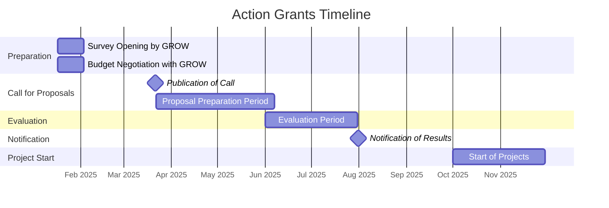

# Action Grants Timeline

1. **Survey Opening by GROW**
    for EC services to submit potential topics for Action Grants
   - **Timeline**: 17 January to 02 February 2025*
   - **Details**: EC services are invited to submit potential topics for Action Grants that they wish to see reflected in the EISMEA open call. The D3 unit can provide support in drafting these topics.

2. **Budget Negotiation with GROW**
   - **Details**: Concurrent with the topic preparation phase, budget needs can be discussed with GROW to ensure adequate allocation for the upcoming grants.

3. **Publication of Call for Proposals**
   - **Expected Publication Date**: 21 March 2025*
   - **Submission Deadline for ESOs**: 06 June 2025
   - **Details**: This call allows applicants approximately 12 weeks to develop and submit their proposals.

4. **Evaluation Period**
   - **Timeline**: June to July 2025*
   - **Details**: Proposals are reviewed by the responsible units, with D3 supporting CNECT-related topics. Evaluations typically take 6–8 weeks, depending on the volume and complexity of submissions.

5. **Notification of Results**
   - **Expected Date**: 31 July 2025*
   - **Details**: Results are communicated to applicants, indicating whether their proposals were successful. Notifications usually follow a few weeks after the evaluation concludes.

6. **Project Start Date**
   - **Expected Timeline**: October to November 2025
   - **Details**: Approved projects are expected to begin in the last quarter of the year, following the finalization of grant agreements.

---

\* *Indicative dates based on the previous year’s timeline. Adjustments may apply.*

## Roadmap

This chart represents:

- The **survey period** and **budget negotiation** in January and February 2025.
- The **call for proposals** publication in March 2025, followed by the **proposal preparation** period until June.
- The **evaluation phase** in June and July 2025.
- **Results notification** in July 2025.
- **Project start** in the last quarter of 2025 (October to November).
