  

# Specification of interfaces and formats for the catalogue of attributes and the catalogue of schemes

## Abstract

The present document specifies the interfaces and formats of European Commission’s catalogue of attributes and catalogue of schemes required by the [European Digital Identity Regulation (EU 910/2014)](https://eur-lex.europa.eu/eli/reg/2014/910/oj/eng). Specification includes data models and applicable application programming interfaces (APIs) for management of machine-readable attestation of attributes schemes.

Management of attribute schemas for the core attributes listed in Appendix VI of the [European Digital Identity Regulation (EU 910/2014)](https://eur-lex.europa.eu/eli/reg/2014/910/oj/eng) is proposed to be handled through the European Commission's common OOTS services and infrastructure. This specification defines the data model to be used, and refers to the ETSI technical specification 119 478 regarding implementation of the verification interface towards authentic sources in member states.

### [GitHub discussion](**~https://github.com/eu-digital-identity-wallet/eudi-doc-standards-and-technical-specifications/discussions/428~**)

## Versioning

| Version | Date       | Description                                                          |
|---------|------------|----------------------------------------------------------------------|
| `0.1`   | 05.09.2025 | Initial version for discussion in sync with topic O discussion paper |

## 1. Introduction and Overview

The present document specifies the interfaces and formats and the application programming interface (API) related to **Catalogues of Attributes and Catalogues of Schemes** according to [European Digital Identity Regulation (EU 910/2014)](~https://eur-lex.europa.eu/eli/reg/2014/910/oj/eng~) - herein [Regulation] and the Commission Implementing Regulation (CIR) [EU 2025/1569](~http://data.europa.eu/eli/reg_impl/2025/848/oj~) of 29 July 2025 laying down rules for the application of Regulation (EU) No 910/2014 of the European Parliament and of the Council as regards qualified electronic attestations of attributes and electronic attestations of attributes provided by or on behalf of a public sector body responsible for an authentic source - herein [CIR for EAAs].

Catalogue of attributes and attributes are addressed in Article  45e of the Regulation and the [CIR for EAAs] lay down further details, which are in scope of present technical document:

(1) Member States shall ensure, within 24 months of the date of entry into force of the implementing acts referred to in Articles 5a(23) and 5c(6), that, **at least for the attributes listed in Annex VI, wherever those attributes rely on authentic sources within the public sector, measures are taken to allow qualified trust service providers of electronic attestations of attributes to verify those attributes by electronic means** at the request of the user, in accordance with Union or national law.

Specifically on [CIR for EAAs]:

In the articles, Article 7 states:
The Commission shall establish and publish a catalogue of attributes and set up a secure system to enable requests to include or modify attributes in the catalogue of attributes.

Particularly, with respect to the **catalogue of attributes** the following are defined:

**Article 7 paragraph 3**
Member States shall request the inclusion of attributes listed in Annex VI to Regulation (EU) No 910/2014 to the catalogue of attributes wherever those attributes rely on authentic sources for the purpose of the verification by qualified trust service providers.

**Article 7 paragraph 3**
In addition, Member States may request the inclusion of attributes not listed in Annex VI to the catalogue of attributes wherever those attributes rely on authentic sources within the public sector. Private entities that are considered to be a primary source of information or recognised as authentic in accordance with Union or national law, including administrative practice, may request the inclusion of attributes not listed in Annex VI to the catalogue of attributes wherever the requesting entity is responsible for those attributes

For the purposes of defining the technical specification, the [CIR for EAAs] specifies regarding the catalogue of attributes to contain of:

1. At minimum the list of attributes that rely on Authentic Sources and metadata - Annex VI of the [Regulation]
2. Namespace, identifier, semantic description and data type for each attribute
3. Verification point for the attribute values at each Member State for the QTSPs

The attribute groups present in Annex VI of the [Regulation] are: Address; Age; Gender; Civil status; Family composition; Nationality or citizenship; Educational qualifications, titles and licences; Professional qualifications, titles and licences; Powers and mandates to represent natural or legal persons; Public permits and licences; For legal persons, financial and company data;

Regarding catalogues of attestations, the **Article 8** states:
The Commission shall establish and publish a catalogue of schemes for the attestation of attributes and set up a secure system to enable requests to include or modify schemes for the attestation of attributes in the catalogue of schemes for the attestation of attributes.

The [CIR for EAAs] specifies the catalogue of schemes for attestations of attributes as a list of attestation schemes and metadata to contain of (at minimum):

1. the name of the scheme
2. the name and contact information of the scheme for the attestation of attributes owner
3. the status and version of the scheme
4. a reference to specific laws, standards or guidelines, where the issuance,  validation, or use of an electronic attestation of attributes within the scope of the scheme is subject to them
5. the format or formats of electronic attestation of attributes within the scope of the scheme
6. one or more namespaces, attribute identifiers, semantic descriptions and data types of each attribute that is part of an electronic attestation of attributes within the scope of the scheme, either by reference to an attribute in the catalogue of attributes in Article 7, or an attribute defined in an analogue way within the scope of the scheme
7. a description of the trust model and the governance mechanisms applied under the scheme, including the revocation mechanisms
8. any requirements concerning the providers or the sources of information on which those providers rely when issuing electronic attestations of attributes
9. a statement whether electronic attestations of attributes within the scope of the scheme are to be issued as qualified electronic attestations of attributes, as electronic attestations of attributes issued by or on behalf of a public sector body responsible for an authentic source, or as both.

The catalogues shall provide their information in both human- and machine-readable format (first presumably via a web service, latter through a high-availability API). API and infrastructure serving data behind it shall meet the requirements for high availability and real-time scheme verification by Wallet Units and Verifiers.

## 2. Data Model for the catalogue of attributes

The data model and common format for catalogue of attributes is designed for hosting from the [Single Digital Gateway](https://eur-lex.europa.eu/legal-content/EN/TXT/PDF/?uri=CELEX:32018R1724&from=EN) and [OOTS Semantic Repository](https://sr.dev.oots.tech.ec.europa.eu/) services of the European Commission, taking into account the requirements from the [Regulation] regarding the mandatory attribute elements to be registered.

As outlined in the figure, the main class of the data model is ****Attribute****, which

* contains the attributes listed in Section 2.1
* defines its own **auxiliary classes**:
  * **AuthenticSourceEVS**
  * **MultiLangString**

> NOTE: Figure remains TBA for this or future version

### 2.1 Attribute

The `Attribute` main class contains two sub-classes `MultiLangString` and `AuthenticSourceEVS` and the attributes specified in the following table:

| Attribute          | Multiplicity | Type  | Description |
|--------------------|--------------|-------|-------------|
| `name`       | [1..1]       | *string*                                                   | English-language (default) attribute name used to identify the attribute within the catalogue of attributes. |
| `identifier` | [1..1]       | *string*                                                   | unique identifier (UUID) assigned for the attribute within the catalogue of attributes. |
| `semDescription`     | [1..1]       | *string*                                                  | URI pointing to semantic description of the attribute in the [OOTS Semantic Repository](https://sr.dev.oots.tech.ec.europa.eu/). **Note:** For registration of attributes onto the repository, re-use of existing descriptions in sources such as [Representation Powers and Mandates (RPaM) Ontology](https://joinup.ec.europa.eu/collection/isa-action-201612-semantic-interoperability-representation-powers-and-mandates-0/solution/representation-powers-and-mandates-ontology#:~:text=The%20ultimate%20objective%20of%20the,structured%20and%20machine%2Dreadable%20format) - [SEMPER \| DE4A](https://www.de4a.eu/semper) - [SEMIC Core Vocabularies](https://interoperable-europe.ec.europa.eu/collection/semic-support-centre/core-vocabularies#What%20are%20the%20Core%20Vocabularies) - [IANA Registry for JSON Web Token Claims](https://www.iana.org/assignments/jwt/jwt.xhtml) (for JSON-based attributes only) - [ISO/IEC 23220-2](https://www.iso.org/standard/86782.html) (for CBOR-based attributes only) SHALL be applied in catalogue of attributes to avoid overlapping interpretations of core attributes. |
| `version`        | [1..1]       | *string*                                                   | Version number of the managed data model, SHALL follow [semantic versioning (SemVer)](https://semver.org/) practices.    |
| `nameSpace`        | [1..1]       | *string*                                                   | inverse-domain-name ordered namespace of the attribute as per NS_dual requirement in ISO/IEC 23220-4 Annex A. Each namespace has one or more data elements.       |
| `localisedName`    | [1..*]       | Array of *[MultiLangString](#245-multilangstring) objects* | contains an array of arrays with valid localised **names of the attribute** in EU Member States. The names should be used for displaying the attribute name in a user-localised user interface of a Wallet Unit, Attestation Provider or Wallet-Relying Party. |
| `authenticSources` | [1..*]       | Array of [*AuthenticSourceEVS*](#xxx-authenticsourceevs) objects | array of `AuthenticSourceEVS` objects. Each Member State providing the attribute through an authentic source/sources shall register their national evidence verification points. The object contains both the MS identifier and the endpoint as an URI - see [**AuthenticSourceEVS**](#xxx-authenticsourceevs). |

#### 2.1.1 MultiLangString

The `MultiLangString` sub-class is used within the definition of the [`Attribute`](#21-attribute) class to provide the country code and language-specific attribute name tuple in`localisedName` array. The codes and strings shall be provided according to the rules set in Annex E of \[ETSI TS 119 612\].

| Attribute | Multiplicity | Type       | Description |
|-----------|--------------|------------|-------------|
| `lang`    | [1..1]       | *string* | Specifies the country code of the localised text. |
| `content` | [1..1]       | *string* | The localised text as a string.                   |

#### 2.1.2 AuthenticSourceEVS

The `AuthenticSourceEVS` sub-class is used within the definition of the [`Attribute`](#21-attribute) class to provide the **Member State identifier**, **data source identifier** and **verification endpoint URI** triple in the `authenticSources` array. The codes and strings shall be provided according to the rules set in Annex E of [ETSI TS 119 612] and national codification schemes. Access control and authorisation for the verification endpoint is specified in Section 5.4 of ETSI TS 119 478.

| Attribute     | Multiplicity | Type       | Description  |
|---------------|--------------|------------|--------------|
| `country`     | [1..1]       | *string* | specifies the member state through a country code.             |
| `nationalSubID`| [0..1]       | *string* | optional, narrows down a respective authentic source in the member state defined in `country` . SHALL be codified through a national coding scheme. Only necessary in member states with multiple authentic sources for the single attribute.                                 |
| `integrationType`        | [1..1]       | *string* |integration type identifier of the endpoint. Valid values are TBD.             |
| `uri`         | [1..1]       | *string* | URI for retrieving data from the verification endpoint    |

> Note: The `authenticSourceEVS` object approach is suited for the verification interface defined for QTSP use in ETSI TS 119 478. It is TBA what is the object structure if a member state is alternatively (or additionally) providing the verification solution via integration through the OOTS Common Services on discovery, request/response & eDelivery for providing the evidencetype/attribute verification service.

## 3. Interfaces for the catalogue of attributes

The OOTS services offer public-access search functions for discovery of registered attributes (the Semantic Repository, offering access to EvidenceTypes (equal to attributes in EUDI Wallet ecosystem) per ) and data sources serving given EvidenceType verification service. It provides the QTSPs and other actors the option to integrate onto the [eDelivery services]() for executing actual attribute validation service against an integrated member state verification endpoint. ETSI TS 119 478 introduces another interface approach through use of [OpenAPI](~https://spec.openapis.org/oas/latest.html~) compatible API and [OAuth 2.0 dynamic client registration profile (RFC 7591)](https://www.rfc-editor.org/info/rfc7591) based mechanism for authentic source verification requests by the QTSPs.

## 4. Catalogue of schemes

### 4.1 Process for registration and updating of Attestation Rulebooks and attestation schemes

#### 4.1.1 Requirements

In the EUDIW ecosystem providers of QEAAs and PUB-EAAs SHOULD register their attestations into the European Commission’s Catalogue of Attestations. EAA providers the registration of a rulebook and accompanied attestation scheme is optional but they MAY freely register their attestations to the Catalogue of Attestations.

Information that combination of Attestation Rulebook and scheme registered in catalogue of schemes SHALL contain, according to [CIR for EAAs] includes the following:

* name;
* status;
* version;
* contact information;
* references to laws and standards applying to the scheme;
* guidelines for the issuance, validation and use of an attestation (e.g. issuance as device-bound or not);
* format(s) of the attestation;
* namespaces, attribute identifiers, semantic descriptions and data types of each attribute;
* attribute definitions or pointer(s) to the catalogue of attributes (Ed note: URI to Semantic Repository)
* applicable trust model, requirements for attestation providers or data sources, and
* type of attestation (Qualified, Pub_EAA or EAA) (Ed note: PID is not strictly speaking an attestation, left out intentionally)

### 4.1.2 Governance for Attestation Rulebooks and attestation schemes

The European Commission's registration and governance (maintenance) process for catalogued Attestation Rulebooks and related requirements, and a rulebook template for documenting of individual attestation of attribute rulebooks and schema is published at the [Attestation Rulebooks Catalogue repository](https://github.com/eu-digital-identity-wallet/eudi-doc-attestation-rulebooks-catalog).

A new, approved catalogued Attestation Rulebook and its attestation schema SHALL be published with version number 1.0. Lifecycle management of published Attestation Catalogues SHALL utilise [semantic versioning (SemVer)](https://semver.org/) in version numbering.

The management and versioning of published Attestation Rulebooks and attestation schemes SHALL be executed through a versioning system for Attestation Rulebooks in human-readable format, and through the [Application Programming Interface](~#5-application-programming-interface~) for machine-readable attestation schemes.

Operations SHALL be authorized by the entity that has registered the Schema.

> Note: A more complete governance description is work in progress, using the draft CD of ISO 23220-7 as the baseline for building a managed registering authority for attestation catalogues. the ISO specification aims at covering the globally recognised mdoc document types, and can well be used as a reference in this specification when approved as International Standard in the ISO.

### 4.2 Data models and formats for attestation schemes

#### 4.2.1 Human-readable format - Attestation Rulebook

The governance model and rules of an individual catalogued attestation of attributes SHALL be documented into its corresponding, publicly accessible Attestation Rulebook. The location of European Commission -managed, open Attestation Rulebooks is the [Attestation Rulebooks Catalogue repository](https://github.com/eu-digital-identity-wallet/eudi-doc-attestation-rulebooks-catalog).

#### 4.2.2 Rulebook template

The Attestation Rulebooks Catalogue repository offers a generic [rulebook template](https://github.com/eu-digital-identity-wallet/eudi-doc-attestation-rulebooks-catalog/tree/main/template) for creation of Rulebooks.

#### 4.2.1 Machine-readable attestation schemes

##### 4.2.1.1 SchemaMeta main class

This is a common attestation schema data model, with one specified sub-class `Schema`.

> NOTE: this class model to be constructed similar as in TS2 and TS5 etc. is TBA. It shall contain the machine-readable elements of the scheme which a) are not present in the human-readable rulebook and b) not explicitly covered by the format-specific schema/schemes.

| Attribute | Multiplicity | Type       | Description   |
|-----------|--------------|------------|---------------|
| `version` | [1..1]       | *string* | version of the schema following SemVer practices  |
| `rulebookURI` | [1..1]   | *string* | URI to the human-readable Attestation Rulebook that SHALL define all non-machine readable aspects of the attestation type defined                |
| `trustModelURI` | [0..1]   | *string* | optional, URI to a machine-readable trust management scheme (trust model) or trust anchor to be used with a Non-qualified EAA attestation type. Requied external trust framework realisations outside the ones covered by [Regulation] SHALL be described in the linked human-readable Attestation Rulebook. The trust model with providers of QEAAs, Pub-EAAs and PIDs is based on European Commission -managed Lists of Trusted Lists [ETSI TS 119 612].      |
| `supportedFormats` | [1..*]       | *array of strings* | array of formats available for the attestation type. Possible string values are `dc+sd-jwt`, `mso_mdoc`, `jwt_vc_json`, `jwt_vc_json-ld` and `ldp_vc`.  |
| `schemaURIs` | [1..*]       | *array of `Schema` objects* | array of persistent and unique, format specific schema URIs assigned for the attestation schemas by the catalogue of schemes registrar.  |

##### 4.2.1.2 Schema sub-class

| Attribute | Multiplicity | Type       | Description   |
|-----------|--------------|------------|---------------|
| `formatIdentifier` | [1..1]       | *string* | string from the set of: `dc+sd-jwt`, `mso_mdoc`, `jwt_vc_json`, `jwt_vc_json-ld` or `ldp_vc`  |
| `uri` | [1..1]       | *string* | persistent schema URI assigned for particular format of the attestation type.   |

> NOTE1: Figure remains TBA for this or future version

> NOTE2: Editor: The 'supportedFormats' may actually require an object class with format type and scheme-specific URI. Availability of the URI upon registration depends on the catalogue used. European Commission catalogue of schemes may assign the final scheme for schemeURI only upon completed registration.

##### 4.1.2.2 Format-specific data models

The attestation schema/s provided via the Catalogue of schemes API SHALL be provided as appendixes of the Attestation Rulebook upon registration.

The schemas SHALL be provided in JSON format, and SHALL follow the following format:

| Issuance format   | Format identifier   | Schema type  |
|-------------------|---------------------|--------------|
| SD-JWT VC         | `dc+sd-jwt`           |The [Verifiable Credential Type (VCT)]() as specified in [OpenID4VCI]() SHALL be used   |
| ISO mDoc          | `mso_mdoc`            |The [DocumentType (DocType)]() format as specified in [ISO 23220-2]() SHALL be used    |
| W3C Verifiable Credentials | `jwt_vc_json`, `jwt_vc_json-ld` or `ldp_vc` | [OpenID4VCI](https://github.com/eu-digital-identity-wallet/eudi-doc-standards-and-technical-specifications/issues/3)  three credential formats possible with [W3C Verifiable Credential]() specifications. OpenID4VCI [Appendix A.1](https://openid.net/specs/openid-4-verifiable-credential-issuance-1_0-15.html#name-w3c-verifiable-credentials) describes the options that SHALL be used for each possible type. |

Note that if several attestation formats are supported, the registering entity SHALL provide all schemas upon registration. Example schema templates are provided in Appendix **TBA** of this specification.

> Ed note: sample schemas to be provided also in the Rulebooks Catalogue repository?

The management of schemas, published for open access via the URLs listed in `SchemaMeta.SchemaURIs` object after publication is done via the catalogue of schemes API.

## 5. Application Programming Interface for verification of machine-readable attestation schemes

### 5.1 Summary

TBA

### 5.2 API methods for attestation schema queries (Open API)

#### 5.2.1 Requirements

The catalogue of schemes API read methods SHALL be open for public access. Access to management of schemes through POST, PUT or DELETE methods SHALL be available only for authorised and authenticated representatives of the registering entity.

The public API SHALL provide methods for downloading complete attestation schemes matching with provided query URL or TBD parameters helping in discovery and validation of registered attestation schemes. The permanent attestation scheme URI SHALL be provided to the registering entity's contact person upon successful registration, and is thereafter referable in Wallet-relying Party registrations irrespective of the role (entitlement) of the registering entity, and consequently for attestation scheme validation by Wallet Units and Wallet-Relying Parties.

#### 5.2.2 Method descriptions

paths:
`/schema` (GET):

There is a single ****GET**** /schema endpoint for making parametrised queries. For this purpose, the API specification has the `parameters` section, where:

* Each filterable field (`list TBA`) is defined as a query parameter.
* `in: query`: Specifies that the parameter is a query parameter.
* `name`: The name of the query parameter.
* `schema`: Defines the data type of the query parameter.
* `description`: Provides a brief explanation of what the query parameter filters by.

Query parameters supported by the GET method are

* TBA

Where query results match at least one attestation schema, the JWS-signed method response SHALL provide:

* JSON (also CBOR required, if mDoc schema exists?) formatted schema registered to matching query URI (Ed note: do we need to provide the full contents of `SchemaMeta` class for given instance?)

If no query parameters are included, the method returns the full list of registered attestation schemes in the Catalogue of Attestations.

The JWS-signed response body for a successful GET `(200)` will be an array of matching `SchemaMeta` objects.

The OpenAPI 3.1 compatible REST API methods for the above are provided in Annex A.5

### 5.3 Protection against DDOS attacks and accidental overuse of the GET methods

The API implementation SHALL take into consideration the vulnerabilities that an open, comprehensive query interface enables for both malicious or non-malicious users of the interface. First well-known vulnerability is sensitivity for Distributed Denial-of-Service (DDoS) attacks, the other valid one especially for the GET/schema endpoint is the server load that very complex query parameter combinations from badly planned or non-intended/accidental misuse of the query mechanism can cause at the Registrar's server-side solution.

### 5.4 DDoS attack protection guidelines

Following policy/recommendation SHOULD be implemented (with solution-fitted combinations) in the national Registry API implementations to protect the API from DDoS attacks:

* Use of ****a Cloud-based DDoS Protection Service/CDN**** as the best first line of defense for volumetric attacks.
* Use of an ****API Gateway or Load Balancer with Rate Limiting**** is crucial for fight against application-layer attacks targeting the API.
* Deploy a ****Web Application Firewall (WAF)**** to protect against other application-layer threats and to complement rate limiting.
* Ensure your infrastructure is scalable by using e.g. ****Load Balancers**** to handle legitimate bursts and some attack traffic.
* Utilise ****Caching**** heavily for the GET endpoints to reduce backend load - many responses might be static or change infrequently, and caching the responses at the CDN, load balancer or application level means the API logic and database will receive less requests.
* Have robust ****API monitoring**** for request rates, latency, error rates, server resource utilisation and source IP addresses with proper alerting in place.
* Utilise ****network segmentation**** - e.g., isolate the API servers in a private subnet behind the WAF, and from the actual Registrar database to improve robustness of your network architecture against hostile attacks.

### 5.5 Protection against unintentional misuse

The implementers SHOULD consider how to limit the load of the API from perfectly legal but unintentionally complex or frequent API calls to the query endpoints. Possible solutions for this are:

* The GET endpoints SHOULD be provided with e.g. rate limiter for calls coming in from an individual IP address.

The European Commission SHALL publish in their respective API documentation what limits it has configured regarding rate limits for legal use, or use of the query parameters. E.g., it could be that the API allows only 3 calls per minute from each IP address, and/or queries with total of 4 parameters (both values are examples - actual limits must be tested during the API implementation and test phases).

### 6 References

| Reference                    | Description        |
|------------------------------|--------------------|
| [Regulation]                 | [European Digital Identity Regulation (EU 910/2014)](~https://eur-lex.europa.eu/eli/reg/2014/910/oj/eng~) |
| [CIR for EAAs]               | [Commission Implementing Regulation \(EU\) 2025/1569 of 29 July 2025 laying down rules for the application of Regulation \(EU\) No 910/2014 of the European Parliament and of the Council as regards qualified electronic attestations of attributes and electronic attestations of attributes provided by or on behalf of a public sector body responsible for an authentic source](~http%3A//data.europa.eu/eli/reg_impl/2025/1569/oj~) |
| [OOTS Common Services]       |    [OOTS Technical Design Documents - Common Services](https://ec.europa.eu/digital-building-blocks/sites/spaces/TDD/pages/909707674/Chapter+3+Common+Services+v1.2.2+July+2025)                   |
| [Specification of common formats and API for relying-party registration information] | [The European Commission Specification of common formats and API for Relying Party Registration information](~https://github.com/eu-digital-identity-wallet/eudi-doc-standards-and-technical-specifications/blob/main/docs/technical-specifications/ts7-common-interface-for-data-deletion-request.md~) |
| [ETSI TS 119 478]                                 | [ETSI TS 119 478 V0.0.2 Electronic Signatures and Trust Infrastructures (ESI); Specification of interfaces related to Authentic Sources](link TBA) (draft) |
| [ETSI TS 119 612]                                 | [ETSI TS 119 612 V2.3.1 Electronic Signatures and Trust Infrastructure (ESI); Trusted Lists](https://github.com/eu-digital-identity-wallet/eudi-doc-standards-and-technical-specifications/issues/41) |
| [ETSI TS 119 602]                                 | [ETSI TS 119 602 V0.0.1 Electronic Signatures and Trust Infrastructure (ESI); List of trusted entities; Data model](https://github.com/eu-digital-identity-wallet/eudi-doc-standards-and-technical-specifications/issues/278) (draft) |
| [OpenID4VCI]    |   [OpenID for Verifiable Credential Issuance 1.0 - draft 17](https://github.com/eu-digital-identity-wallet/eudi-doc-standards-and-technical-specifications/issues/3) (draft)                  |
| [ISO 23220-2]   |   [ISO/IEC TS 23220-2:2024 - Cards and security devices for personal identification — Building blocks for identity management via mobile devices, Part 2: Data objects and encoding rules for generic eID systems](https://github.com/eu-digital-identity-wallet/eudi-doc-standards-and-technical-specifications/issues/388)                          |
| [ISO 23220-7]   |   [ISO/IEC AWI 23220-7 - Cards and security devices for personal identification — Building blocks for identity management via mobile devices, Part 7: Registration Authority Procedures for Mobile Document](https://www.iso.org/standard/90046.html) (draft)                  |

## Annex A

### A.1 JSON Schema for attributes in Catalogue of Attributes (normative)

TBA

### A.2 JSON Schema for SD-JWT VC attestation schemas in Catalogue of Schemes (normative)

TBA

### A.3 JSON Schema for ISO mdoc attestation schemas in Catalogue of Schemes (normative)

TBA

### A.4 JSON Schemas for W3C VC format attestation schemas in Catalogue of Schemes (informative)

TBA

### A.5 OpenAPI Specification for Catalogue of Schemes API (normative)

The file [`ts11-openapi31-attesttionschemes-api.yml`](~api/ts11-openapi31-attestationschemes-api.yml~) contains the [OpenAPI](~https://spec.openapis.org/oas/latest.html~) specification of the JSON and REST based application programming interface methods described in [Section 5](~#5-application-programming-interface~).

### A.6 XML Schemas (informative)

TBA
