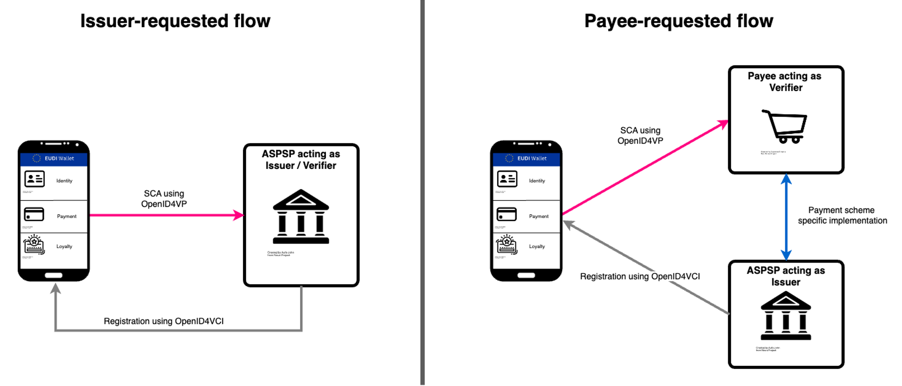

<br/>

# Specification of Electronic Payments Strong Customer Authentication (SCA) Implementation with the Wallet

## Abstract

The present document specifies structures and processing rules of the transactional data for conducting Strong Customer Authentication (SCA) in payments according to [PSD2] with use of the European Digital Identity Wallets.

### [GitHub discussion](https://github.com/eu-digital-identity-wallet/eudi-doc-standards-and-technical-specifications/discussions/439)

## Versioning

| Version | Date        | Description                              |
|---------|-------------|------------------------------------------|
| `0.1`   | 10.10.2025  | Initial version for the first discussion |

## 1 Introduction

### 1.1 Overview

Strong Customer Authentication (SCA) for payments is mandated under PSD2 Article 97(1)(b) for electronic payment initiation, as well as accessing a payment account or other User's actions that present a risk of fraud. By design, the EUDI Wallet supports all three authentication factors required by PSD2 (knowledge, possession, inherence) to enable SCA.

To ensure interoperability, a set of requirements is specified for the implementation of electronic payments SCA using the Wallet. This technical specification is based on the discussion within Topic W and AA.

### 1.2 Scope of the document

The present document provides:

- overview of the SCA scenarios at stake,
- processing and rendering rules for display messages for the Wallet User,
- response specification,
- other requirements impacting the Wallet Solution functionality, i.e. necessary profiles of the presentation protocols,
- security requirements.

This specification relies on and is complementary to [SCA Attestation Rulebook] that specifies:

- SCA Attestation attributes and metadata,
- structures and compositions elements of the transactional data transported by a presentation protocol,
- set of requirements and option selection for the presentation protocol.

In general, this specification aims to define the behaviour of the Wallet Units when receiving a presentation request of attributes from a SUA Attestation used for SCA in payments (hereinafter called "SCA Attestation"). Therefore, the Wallet Solution Providers SHALL implement their Wallet Solutions in compliance with this document.

At the same time, the related [SCA Attestation Rulebook], delivered by the financial sector, provides all the necessary information and requirements for:

+ Attestation Providers (Payment Service Providers, such as banks) to issue their SCA Attestations,
+ Relying Parties (Payment Service Providers or other payment actors, such as payees or Payment Initiation Service Providers) to make  presentation requests of the SCA Attestation, as payment transaction authentication.
Therefore the Attestation Providers and Relying parties SHALL follow the SCA Attestation Rulebook.

The current version of the document focuses on [SD-JWT-VC] format and [OID4VP] presentation protocol only.

### 1.3 Requirements Notation

The key words "REQUIRED", "SHALL", "SHALL NOT", "SHOULD", "SHOULD NOT", "RECOMMENDED", "NOT RECOMMENDED", "MAY", and "OPTIONAL" in this document are to be interpreted as described in RFC2119 RFC8174 when, and only when, they are written in all capital letters.

### 1.4 Terminology

| Term               | Definition   | Based on  |
|--------------------|--------------|-----------|
| Payment Service Provider (PSP) | A credit institution, electronic money institution, post office giro institution, or payment institution offering payment services to Payers and/or Payees. | [PSD2] Article 4 (11) |
| Account Servicing Payment Service Provider (ASPSP); synonyms: Issuer, Payer's PSP, Issuing PSP |Payment Service Provider providing and maintaining a payment account for a Payer and issuing the Payment Credential into his/her Wallet. | [PSD2] Article 4 (17) |
| EU Digital Identity Wallet (EUDIW); synonym: Wallet | An electronic identification means which allows the User to securely store, manage and validate person identification data and electronic attestations of attributes for the purpose of providing them to relying parties and other Users of European Digital Identity Wallets. | [eIDAS] Article 1 (3) (j) (42) |
| Payee | A natural or legal person who is the intended recipient of funds which have been the subject of a payment transaction. | [PSD2] Article 4 (9) |
| Payer; synonyms: User, Holder, Account Holder | A natural person who holds a payment account and allows a payment order from that payment account, and who uses an EUDIW provided in accordance with [eIDAS]. | [PSD2] Article 4 (8), [eIDAS] Article 1 (3) (b) |
| Payment Credential; synonym: SCA Attestation | A digital credential in the form of an Electronic Attestation of Attributes, issued by the Attestation Provider into the User's Wallet to facilitate payment use cases. |  |
| Acquirer; synonym: Payee's PSP | The Payment Service Provider of the Payee. | [PSD2] Articles 4 (9) and (11) |
| Merchant | A type of Payee, typically offering goods or services to Users. | n/a |
| Intermediary | An entity acting on behalf of the Payer's PSP or the Payee. | [eIDAS] Article 1 (5) (5b) (10)  |

Further capitalised words and terms, not included in the above table, are to be interpreted in line with [ARF] Annex 1.

## 2 High-level Solution Design

### 2.1 Process flows

On a high level, the solution is composed of the following parts:

+ **Registration**: The secure association of the Wallet Unit and Holder with the Account Holder by means of the Payer's PSP issuing a dedicated, cryptographically bound Payment Credential into the User's Wallet.
+ **Authentication**: The Strong Customer Authentication at time of transaction by means of presenting the Payment Credential.
+ **Dynamic Linking**: linking of presentation transaction to a specific payment transaction by means of including payment transaction specific information in the presentation request and response.

The solution furthermore addresses the regulatory requirement that the Payer can give consent to execute a payment directly towards their PSP, or via the Payee or a PISP:

+ Directly towards their PSP: In this case, it is the Payer's PSP that invokes the User's Wallet. The User may be entirely in the context of their PSP (e.g., interacting with their online/mobile banking to send a credit transfer) or he/she may have been redirected from the Payee (e.g., a Merchant). Referred to as “**Issuer-requested flow”** hereinafter.
+ Via the Payee: In this case, it is the Payee that invokes the User's Wallet. The response is then relayed to the Payer's PSP using a given payment rail or scheme. The Payer's PSP evaluates the evidence and returns a response to the Payee. Referred to as “**Payee-requested flow**” hereinafter.  

The diagram below presents both scenarios.



### 2.2 Schemas

This specification covers the following flows:

+ Issuer-requested,
+ Payee-requested.

Each of the flows MAY provide with its own "schema" for transaction processing.

Each schema contains (at least) the following data structures:

+ (1) transactional data schema (for constructing a presentation request),
+ (2) display schema (for rendering information displayed to the Wallet User),
+ (3) localisation information (for proper translations of information for the Wallet User),
+ (4) response schema (for delivering an authentication code as proof of consent for the payment transaction).

The structures (1), (2) and (3) are specified in [SCA Attestation Rulebook]. The structure (4) is specified in this document. _(Editor's note: to be decided if in this document or in the rulebook)_

### 2.3 SUA Attestation for SCA

A SUA Attestation for SCA purposes (hereinafter called "SCA Attestation") is an attestation issued by a PSP into a Wallet Unit that serves as a verifiable digital proof that the Wallet Unit is associated with a specific Payer and their account managed by the PSP.

In the payments ecosystem, payment data structures differ between payment methods. Therefore there will be multiple types and versions of SCA Attestations. The structures of the SCA Attestations applicable to this specification are specified in the related [SCA Attestation Rulebook].

The following is a non-normative example of an SCA Attestation, for a card-based payments:

```
{
  "iss": "https://issuer.superbank1.com",
  "aud": "https://rp.superbank1.com",
  "sub": "4f473c31-0e0a-4e54-8bb0-b69dc2a03b23",
  "iat": 1683000000,
  "nbf": 1683000000,
  "exp": 1883000000,
  "vct": "https://credentials.cardpaymentauthority.com/card-authenticator",
  "cnf": {
    "jwk": {
      "kty": "EC",
      "crv": "P-256",
      "x": "TCAER19Zvu3OHF4j4W4vfSVoHIP1ILilDls7vCeGemc",
      "y": "ZxjiWWbZMQGHVWKVQ4hbSIirsVfuecCE6t4jT9F2HZQ"
    }
  }
  "panLastfour": "1234",
  "iin": "412345",
  "parLastfour": "5D3E",
  "aliasId": "7d63281b-7c9b-4e5b-9121-053d8594bbfe",
  "currency": "EUR",
  "scheme": "Visa",
  "schemeLogo": "https://www.visa.com/logo.png" 
}
```

The following is a non-normative example of the SCA Attestation, for account-based payments:
```
{
  "iss": "https://issuer.superbank2.com",
  "aud": "https://rp.superbank2.com",
  "sub": "37774a3f-ab14-43c3-96bc-bb1066a30a1d",
  "iat": 1683000000,
  "nbf": 1683000000,
  "exp": 1883000000,
  "vct": "https://psd2.standard.org/payment_account",
  "cnf": {
    "jwk": {
      "kty": "EC",
      "crv": "P-256",
      "x": "TCAER19Zvu3OHF4j4W4vfSVoHIP1ILilDls7vCeGemA",
      "y": "ZxjiWWbZMQGHVWKVQ4hbSIirsVfuecCE6t4jT9F2HZZ"
    }
  }
  "ibanLastFour": "3455",
  "bic": "COLSDE33",
  "sortCode": "123456"
  "aliasId": "3b300b2a-75a9-4be3-a372-c30bea22aebe",
  "currency": "EUR",
}
```

### 2.4 Metadata

The associated SCA Attestation Rulebook mandates the use of specific metadata in the SCA Attestation, extends their specifications where necessary, and introduces new metadata sources to enhance trust, interoperability, and usability in the context of payments.

This section provides a high-level overview of the metadata; the complete, normative specifications are contained in [SCA Attestation Rulebook].  

#### 2.4.1 SCA Attestation Type Metadata

The SCA Attestation Provider SHALL publish the metadata parameters in accordance with the specification provided in [SD-JWT-VC].
This metadata contains a `transaction_data_schema` object that MAY be used during the presentation of the given SCA Attestation.

The value is an object contains i.a. the following parameters:

+ `schema` - a URI pointing to a JSON Schema describing the structure of the `transaction_data` object,
+ `i18n` - a URI pointing to a JSON document containing a catalog of string identifiers and their localized representations for the descriptions of each field described by the schema.

The full list and specification of parameters of this metadata is in [SCA Attestation Rulebook].

The following is a non-normative example of the SCA Attestation type metadata:

```
{
  "vct":"https://pay.example.com/card",
  "name":"pay.example Payment Credential",
  "description":"This is a pay.example Payment Credential",
  "extends": "https://pay.example.com/basic-schema-1.2",
  "extends#integrity":"sha256-9cLlJNXN-TsMk-..5ca_xGgX3c1VLmXfh-WRL5", "schema_uri":"https://pay.example.com/card-schema-1.0",
  "schema_uri#integrity": "sha256-o984vn819a48..5t0WRL5ca_xGgX3c1VLmXfh",
  "transaction_data_schemas": {
    "https://pay.example/trx/single_payment" : {
    "schema": "https://pay.example/trx/en/single-schema-1.0"
    "i18n": "https://pay.example/trx/en/i18n"
    }
  }
}
```

#### 2.4.2 Transactional Data Schema

The referenced in previous section JSON schema of a `transaction_data` object, specifies a set of parameters out of those envisioned by [OID4VP].

It uses i.a. the following parameters:

+ `transaction_id` - identifier of the payment transaction, to be consented by the Wallet Unit User,
+ `display` - an object containing parameters that the Wallet is to present to the User when obtaining consent for an SCA Attestation presentation; the Wallet Unit needs to retrieve the localized string from the localization catalog, which is specified in the `i18n` parameter of the SCA Attestation metadata.

The following is a non-normative example of `transactional_data_schema`:

```
{
    "$schema": "https://json-schema.org/draft/2019-09/schema#",
    "title": "SinglePaymentRequest",
    "type": "object",
    "properties": {
        "type": {
            "type": "string"
        },
        "credential_ids": {
            "type": "array",
            "items": {
                "type": "string"
            }
        },
        "transaction_data_hashes_alg": {
            "type": "string"
        },
        "transaction_id": {
            "type": "string"
        },	
        "display": {
            "type": "object",
            "title": "Payment",
            "description": "Payment details",
            "additionalProperties": false,
            "required": [
                "amount",
                "currency",
                "payee"
            ],
            "properties": {
                "amount": {
                    "type": "string",
                    "minLength": 1,
                    "maxLength": 8,
                    "title": "single_payment.display.amount.title",
                    "description": "single_payment.display.amount.description"
                },
                "currency": {
                    "type": "string",
                    "title": "single_payment.display.currency.title",
                    "description": "single_payment.display.currency.description",
                    "pattern": "^[A-Z]{3}$",
                    "minLength": 3,
                    "maxLength": 3
                },
                "payee": {
                    "type": "string",
                    "title": "single_payment.display.payee.title",
                    "description": "single_payment.display.payee.description",
                    "maxLength": 140
                }
            }
        }
    },
    "additionalProperties": false
}
```

The catalogue of permitted and applicable to this specification transaction data schemas is contained in [SCA Attestation Rulebook].

## 3 Presentation Request Processing

### 3.1 Embedded Disclosure Policy Verification

The SCA Attestation SHALL support an embedded disclosure policie, specified in [SCA Attestation Rulebok].
The Wallet Unit SHALL read from the SCA Attestation embedded discolsure policy the unique identifier(s) of the Relying Parties permitted access the SCA Attestation and verify if the presentation request is sent by a permitted Relying Party.

In case of negative result of verification, the Wallet Unit SHALL cease processing of the request.

### 3.2 Transactional Data Discovery and Validation

To determine whether and which kinds of transactions a given SCA Attestation type supports, Relying Parties MUST use only transaction data objects compatible to the types and their according JSON Schemas specified by the `transaction_data_schema` parameter published in the SCA Attestation metadata.

Upon receiving the SCA Attestation presentation request, the Wallet Unit SHALL read out from the SCA Attestation metadata `transaction_data_schema` value, to retrieve transaction data type identifier indicating the type of transactional data received (eg. "https://pay.example/trx/single_payment").

The Wallet Unit SHALL verify it the transactional data type is known, that means if the `type` value is equal to the value of the transaction data type identifier in the SCA Attestation metadata.

Additionally, the Wallet Unit SHALL verify if the received transactional data (in the `transaction_data` object in [OID4VP]) conforms to the JSON schema specified by `_schema`, referenced in the schema property of SCA Attestation metadata.

If the verification is positive, the Wallet Unit MAY continue processing of the transactional data (and the presentation request).

Otherwise, the Wallet Unit SHALL cease processing of the presentation request and display an error message to the Wallet User.

### 3.3 Transactional Data Processing

The transactional data are processed for the follwing purposes:

+ display message(s) rendering,
+ user consent proof generation and delivery,
+ other purposes not related to the two above.

#### 3.3.1 Transaction Data Object

The Wallet Unit is delivered a `` object by the [OID4VP] presentation protocol. The `transaction_data` object SHALL be composed according to `transaction_data_schema` indicated in the SCA Attestation metadata.

The `transaction_data` object related to an SCA transaction, SHALL contain all the mandatory data elements as specified in [SCA Attestation Rulebook].

The following is a non-normative example of the `transaction_data` object:

```
{
  "type": "https://pay.example/trx/single_payment",
  "credential_ids": ["payment_credential"],
  "transaction_data_hashes_alg": "sha-256",
  "transaction_id": "b0f75d4d-996b-46df-abb6-e3ddec390d2b",
  "display": {
    "payee": "Merchant XYZ",
    "currency": "EUR",
    "amount": "100.00"
  }
}
```

#### 3.3.2 Display Message Rendering

The message displayed to the User when giving consent for presentation of attributes from an SCA Attestation (and thereby for a payment transaction) SHALL be composed from the following data element groups:

+ (1) attributes to be presented (from SCA Attestation and other attestations possibly),
+ (2) payment transaction data (from the presentation request),
+ (3) Attestation Provider or Relying Party related data, retrieved from or via the SCA Attestation.

For the data element group (1), the rendering of display messages SHALL follow the general presentation rules as for attributes from PID or attestations that do not involve transactional data (as specified in [ARF]).

For the data element groups (2) and (3), the rendering of display messages SHALL follow the rules specified in this document.

To render display messages in relation to data element groups (2) and (3), the Wallet Unit SHALL use display-related information contained in `display` parameter of the `transaction_data` object, contained in the [OID4VP] presentation request.

Effectively, the display message SHALL combine all data elements (1), (2) and (3) and present in one or more screens, in the hierarchy and order as indicated in [SCA Attestation Rulebook]. The message SHALL contain at least all the mandatory data elements as specified by  [SCA Attestation Rulebook].

#### 3.3.2 Localisation

(tbd)

#### 3.3.3 User Consent Proof

Refer to section 3.3.

#### 3.3.4 Other Processing (tbd)

The Wallet Unit MAY sign the authorisation request received from a Relying Party.

_(Editor's note: to include what else is being done by the Wallet Unit, if anything.)_

#### 3.4 Combined Presentation

Relying Party may request attributes from multiple attestations in a single [OID4VP] presentation request. 
Therefore a presentation request can combine attributes from an SCA Attestation and other (non-SCA) attestations, enabling combination of payments and additional attributes presentation. Examples for such use cases could be payment plus age verification, driver's licence or loyalty cards.
The Digital Credentials Query Language (DCQL) allows the Relying Party to specify a combination of various (non-SCA Attestation related) attributes to facilitate the payment transaction. The details and examples on making DCQL queries in combined presentation request is presented in [SCA Attestation Rulebook].

_(Editor's note: to decide how other attributes are presented - if there are any differences than presenting SCA Attestation attributes.)_

### 3.5 Presentation Response

After the User giving the consent for presentation, the Wallet Unit SHALL provide a response according to [OID4VP].

The presentation of an SCA Attestation in the [SD-JWT-VC] format SHALL include a Key Binding JWT (KB-JWT) to ensure cryptographic binding of the User action and the payment transaction, as well as to guarantee the freshness and uniqueness of the presentation.

This document defines the following additional claim for the KB-JWT:

+ `jti` - a fresh, cryptographically random value with sufficient entropy; as this value is generated uniquely for each presentation and thereby transaction, this value serves as the Authentication Code required by [PSD2] in the context of electronic payments.

The `iat` claim of the KB-JWT MAY be used by a Relying Party to restrict the timeframe in which the SCA result is accepted.

The following is a non-normative example of the KB-JWT object:
```
{
   "aud": "x509_san_dns:shop.example.com",
   "iat": 1741269093,
   "jti": "deeec2b0-3bea-4477-bd5d-e3462a709481",
   "nonce": "bUtJdjJESWdmTWNjb011YQ",
   "sd_hash": "Re-CtLZfjGLErKy3eSriZ4bBx3AtUH5Q5wsWiiWKIwY",
   "transaction_data_hashes": [
       "OJcnQQByvV1iTYxiQQQx4dact-TNnSG-Ku_cs_6g55Q"
   ],
   "transaction_data_hashes_alg": "sha-256"
}
```

### 4 Other Requirements (TBD)

This section specifies various other requirements:

+ functional,
+ non-functional,
+ profiling of the presentation protocols,
+ security.

### 5 References

| Reference      | Description |
|----------------|-------------|
| [Regulation (EU) No 910/2014] | [Regulation (EU) No 910/2014 of the European Parliament and of the Council of 23 July 2014 on electronic identification and trust services for electronic transactions in the internal market and repealing Directive 1999/93/EC](https://eur-lex.europa.eu/legal-content/EN/TXT/HTML/?uri=CELEX:32014R0910) |
| [Regulation (EU) 2024/1183] | [Regulation (EU) No 910/2014 of the European Parliament and of the Council of of 11 April 2024 amending Regulation (EU) No 910/2014 as regards establishing the European Digital Identity Framework](https://eur-lex.europa.eu/legal-content/EN/TXT/?uri=celex%3A32024R1183)  |
| PSD2 |[Directive (EU) 2015/2366 of the European Parliament and of the Council of 25 November 2015 on payment services in the internal market [...]](https://eur-lex.europa.eu/eli/dir/2015/2366/oj/eng) |
| [SCA Attestation Rulebook]      | (_tbd - it is not published yet_) |
| [ARF]      | [Architecture and Reference Framework](https://github.com/eu-digital-identity-wallet/eudi-doc-architecture-and-reference-framework/blob/main/docs/architecture-and-reference-framework-main.md) |
| [JWE]      | [JSON Web Encryption (JWE), RFC 7516](https://github.com/eu-digital-identity-wallet/eudi-doc-standards-and-technical-specifications/issues/433) |
| [JWA]      | [JSON Web Algorithms (JWA), RFC 7518](https://datatracker.ietf.org/doc/rfc7518/) |
| [JSON]      | [The JavaScript Object Notation (JSON) Data Interchange Format, RFC 8259](https://github.com/eu-digital-identity-wallet/eudi-doc-standards-and-technical-specifications/issues/79) |
| [SD-JWT-VC]      | [SD-JWT-based Verifiable Credentials (SD-JWT VC)](https://github.com/eu-digital-identity-wallet/eudi-doc-standards-and-technical-specifications/issues/9)|
| [ISO/IEC 18013-5]  | [ISO/IEC 18013-5 - Mobile driving licence (mDL) application, First edition, 2021-09](https://github.com/eu-digital-identity-wallet/eudi-doc-standards-and-technical-specifications/issues/84) |
| [OID4VP] |    [OpenID for Verifiable Presentations 1.0](https://github.com/eu-digital-identity-wallet/eudi-doc-standards-and-technical-specifications/issues/2)    |
| [OID4VCI] |    [OpenID for Verifiable Credential Issuance 1.0](https://github.com/eu-digital-identity-wallet/eudi-doc-standards-and-technical-specifications/issues/3)    |
