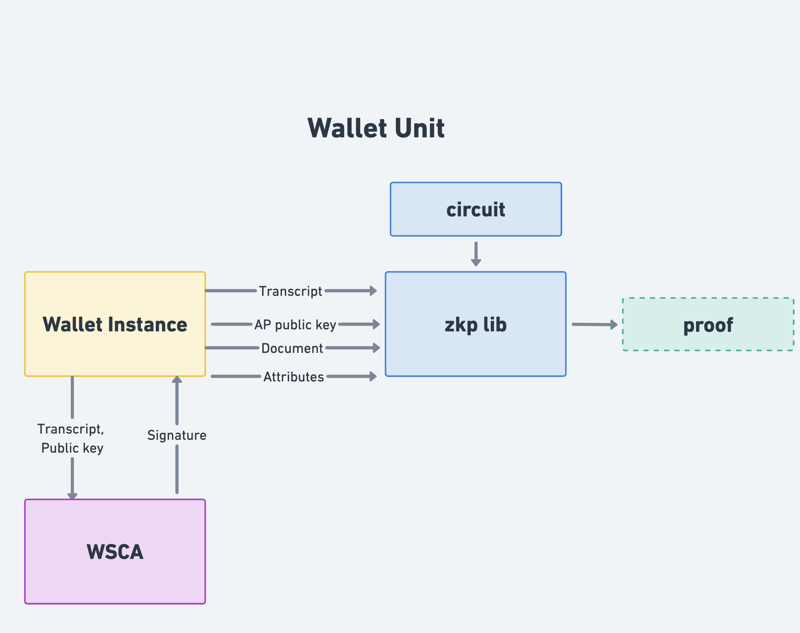

<br/>

# Specification for the implementation of Zero-Knowledge Proofs based on arithmetic circuits in the EUDI Wallet

## Abstract

The present document specifies the technical specification and requirements for
the implementation of Zero-Knowledge Proof (ZKP) based on arithmetic circuits
in the EUDI Wallet.

### [GitHub discussion](https://github.com/eu-digital-identity-wallet/eudi-doc-standards-and-technical-specifications/discussions/440)

## Versioning

| Version | Date | Description |
|---------|------------|------------|
| `0.7` | 14.10.2025 | Improvements based on internal review
| `0.6` | 09.10.2025 | Detailed circuit description extended, initial description of presentation protocols |
| `0.5` | 02.10.2025 | Initial description for section 4.2 Detailed circuit description |
| `0.4` | 22.09.2025 | Scope update, information about revocation |
| `0.3` | 15.09.2025 | Information about attestation and presentation formant, scope update |
| `0.2` | 12.09.2025 | Scope and information about the longfellow-zk library|
| `0.1` | 05.09.2025 | Initial version based on TS-4|

## 1 Introduction and Overview

This document follows up on the [TS-4 - Specification for ZKP Implementation in EUDI Wallet](ts4-zkp.md).  
It defines the requirements and technical specifications for integrating a ZK presentation of an
mdoc or SD-JWT credential. As there is no algebraic structure in those legacy formats, the ZK statement
will be expressed as an arithmetic circuit. Any suitable ZK system capable of producing a ZK proof that the
statement is valid can satisfy these requirements.

Regulation (EU) 2024/1183 of the European Parliament and of the Council of 11
April 2024 amending Regulation (EU) No 910/2014 as regards establishing the
European Digital Identity Framework [European Digital Identity Regulation], Recital 14, discusses the use of
privacy-preserving technologies, such as zero knowledge proof:

> Member States should integrate different privacy-preserving technologies, such
as zero knowledge proof, into the European Digital Identity Wallet. Those
cryptographic methods should allow a relying party to validate whether a given
statement based on the person’s identification data and attestation of
attributes is true, without revealing any data on which that statement is based,
thereby preserving the privacy of the user.

Similarly, Recital 15 of [European Digital Identity Regulation] mentions:

> All Union citizens [...] should be empowered to securely request, select, combine,
store, delete, share and present data related to their identity [...] while enabling
selective disclosure of personal data

Recital 59 of [European Digital Identity Regulation] provides the following definition and requirements for
selective disclosure:

> Selective disclosure is a concept empowering the owner of data to disclose only
certain parts of a larger data set, in order for the receiving entity to obtain
only such information as is necessary for the provision of a service requested by
a user. The European Digital Identity Wallet should technically enable the
selective disclosure of attributes to relying parties. It should be technically
possible for the user to selectively disclose attributes, including from multiple,
distinct electronic attestations, and to combine and present them seamlessly to
relying parties. This feature should become a basic design feature of European
Digital Identity Wallets, thereby reinforcing convenience and the protection of
personal data, including data minimisation.

Furthermore, Article 5a, 16 of [European Digital Identity Regulation] mandates for "the technical framework
of the European Digital Identity Wallet" to:

> (a) not allow providers of electronic attestations of attributes or any other
party, after the issuance of the attestation of attributes, to obtain data that
allows transactions or user behaviour to be tracked, linked or correlated,
or knowledge of transactions or user behaviour to be otherwise obtained, unless
explicitly authorised by the user;
> (b) enable privacy preserving techniques which ensure unlinkability, where the
attestation of attributes does not require the identification of the user.

Finally, article 11a.2 of [European Digital Identity Regulation] mandates that:

> Member States shall provide for technical and organisational measures to
ensure a high level of protection of personal data used for identity matching
and to prevent the profiling of users.

## 1.1 Document structure

This document is structured as follows:

- Section 2 outlines the high-level requirements addressed by this Technical
Specification.
- Section 3 provides the justification for taking this approach by describing a possible solution.
- Section 4 details the circuits required for implementing the functionality presented in Section 2, and discusses its integration
within the EUDI wallet.  
- Section 5 discusses changes required to presentation protocols
- Section 6 discusses revocation
- Section 7 details how a proof and a circuit are serialized

## 2 High-level requirements

This Technical Specification defines a solution designed to safeguard Users' privacy against tracking.  
The solution ensures that Users SHALL be protected both from collusion between Relying Parties and from scenarios  
where Relying Parties collude with Attestation Providers.Additionally, this 
Technical Specification is focused on remote presentation flows. Particularly the following are in
scope of this Technical Specification

**In scope**

* Selective disclosure of attributes of attestations encoded using the mdoc
and SD-JWT VC formats, achieving:
  * Privacy preserving selective disclosure as considered by
Recitals 14, 15, and 59 of the [European Digital Identity Regulation]
  * Compliance with Articles 5a(16) and 11a(2) of the [European Digital Identity Regulation]
* The interface between a Wallet Instance and a zkp library.
* Attestation format and presentation protocols (**Note** Modifications in the second draft of
ISO 18013-5. The status of OID4VP is not clear)
* Revocation
* Proof and circuit serialization (**Note** This is also done in parallel at
https://datatracker.ietf.org/doc/draft-google-cfrg-libzk/)

**Out of scope**
The following items are considered out of scope for this Technical Specification:
* Proximity-based flows (**Note** Proof sizes are on the order of 200KB, which
makes them impractical for proximity use cases. However this violates HLR ZKP_05
of Annex 2 of the ARF)
* Pseudonyms (**Note** This requires changes to the issuance process,
specifically binding attestations to a secret that is then used to derive
the pseudonym)  
* Cryptographic validation
* Combined presentation of attributes
* Use of ZKP during attestation issuance (e.g., use of ZKP in WUA, use of ZKP for
proving that two attestation are bound to the same WSCA/WSCD)
* Issuer hiding

## 3 Overview of a circuit-based ZK system.

We consider in scope any zero-knowledge proof (ZKP) solution based on programmable arithmetic circuits.  
In this approach, a program is represented as an arithmetic circuit that accepts two types of inputs:  
a secret input, called the witness (e.g., an attestation), and a public statement.  
The circuit evaluates these inputs and outputs *true* if the defined conditions are satisfied (e.g.,  
"the attestation contains an age attribute greater than 18").  

A Wallet Unit can then generate a ZKP demonstrating that it possesses a valid witness which, when  
used with the specified circuit and public statement, results in the circuit outputting *true*.  

### 3.1 Setup

The solution class considered herein does not require a trusted setup phase. However, the arithmetic circuits used for cryptographic computations within the Wallet Unit must be designed, implemented, and distributed with great care to ensure correctness and security.  

### 3.2 Issuance

PID Providers or Attestation Providers remain unaffected by this scheme.  
No changes are required to the existing attestation issuance process.  

### 3.3 Presentation

To generate a zero-knowledge proof of attestation possession, the Wallet Unit encodes the attestation  
as private inputs (witnesses) to an arithmetic circuit representing the desired statement.  
The circuit also specifies any public inputs, such as the Provider’s public key.  
The Wallet Unit then executes the zkSNARK prover algorithm over the circuit using the witnesses and public inputs,  
producing a succinct proof. This proof can be verified by any relying party using only the public inputs
and the circuit.  

### 3.4 Performance

As evidence that this approach is well-suited for the privacy needs of the EUDI wallet, we here
present performance results from the literature.
According to [Fri2024], the Longfellow ZK library can generate a proof that an [ISO/IEC 18013-5] attestation is valid  
and includes an `age_over_18` attribute in approximately 1.2 seconds on a Pixel 6 Pro device.  
Verification of the proof requires about 0.6 seconds, and the proof size is around 400 KB.  

### Discussion
- Who will be responsible for designing, implementing, evaluating, and distributing
circuits? One approach is that there will be a centralized entity. Another is to 
allow a different circuit per Attestation Provider. 
- Shall we consider optimizations on the provider side?

## 4 Detailed circuit description

(**Work in progress**)

This section outlines a small set of circuit classes that will be useful in the EUDI wallet.  
The aim is to define a circuit `C(x,w)` that takes a public input `x` and a private input `w` and validates that the presentation defined by `x`. Thus, the public input `x` must include all of the information that *defines* a presentation claim, and must *exclude* any private or linkable information.

The circuits here are expressed so that any ZK system that operates on arithmetic circuits should be able to encode the relevant theorem statement.  For deployment and management purposes, it is important to reduce the number of circuits needed to support all applications.  At the same time, it is also important to design circuits that are small, easily auditable, and performant---naturally both concerns conflict with one another.

A circuit must be parameterized by a few universal quantities: the input size of the theorem statement. The theorem statement includes public parameters, such as a list of issuers, a time of day, a list of constraints on attributes, and private witnesses such as the original identity document, signatures by the issuer and device-bound keys, as well as auxiliary information that aids in verifying the statement.  The size of both of these components is a natural parameter for the circuit.  As such, the circuits shall be parameterized by the following quantities:

1. The size of the input document format in bytes.
2. The number of attributes disclosed in the presentation and their maximum size.
3. The number of potential valid issuers under which the document has been signed.

For example, a reasonable parameter selection might be (2000,3,64, 27) which supports 2000byte documents that allow disclosure of up to 3 identity attributes of up to 64 bytes that have been issued under a key that itself is signed by one of among 27 possible CA keys.

### Further specialization by scheme

Based on current best practices for ZK, it may also be favorable to further specialize circuits that are tailored for certain signature schemes and hash functions.  For example, a circuit may be specialized to only support ECDSA signatures for the P256 elliptic curve using SHA-256 as the hash function.

### Further specialization by predicate

The current MDOC and SD-JWT standards only allow asserting equality on the disclosed attributes. Some future standards allow a more expressive query language (e.g., OID4VP DCQL). It may be suitable to specialize circuits based on the predicates that are allowed for attributes. For example, for current EUDI functionality, it may be suitable to specialize circuits that only support checking for equality with a given string on the attributes that are presented.

### Circuit for ISO 18013-5 Attestations

This section begins with a high-level specification for a circuit that verifies an ISO 18013-5 mdoc credential. The aim is to
describe the constraints that should be verified, and then iteratively refine the constraints until a low-level circuit can be extracted.

Per the framework above, the generic class of circuits defined in this section are meant to be specialized by their universal, scheme, and predicate parameters.  For example, the simplest example can be a (2000,3,64,1) credential that supports (ECDSA P256, SHA-256) and only the equality predicate for attributes.

* The public information vector `x` contains (a) the x and y coordinates of the issuer's public key certificate, ipkx, and ipky, (b) the namespace, attribute name, and expected attribute value for each attribute that is disclosed, (c) the hash of the transcript, e2, used to define the freshness of the session and device-binding, and (d) the time `now`, in mdoc format, used to determine whether the credential has not expired and is currently valid.

* For now, we defer defining the private inputs, and instead specify the set of constraints that need to be validated:
   1. There exist values e, (r,s) such that 0 < e,r,s < p, and verify_p256(ipkx, ipky, e, (r,s)) = true. In other words, there exists a signature under the issuer's public key on a message whose SHA-256 hash is equal to e.
   2. <Note, it is better to have the CA key given as input, and verify that ipkx, ipky is signed by the CA>
   3. There exist values (r2, s2) and a device key (dpkx, dpky) such that verify_p256(dpkx, dpky, e2, (r2,s2)) = true.  This constraint verifies that the challenge message is signed by some key.
   4. There exists a byte string `mdoc` of length at most MAX such that SHA-256(mdoc) = e, and `mdoc` is a valid CBOR-encoded string.
   5. There exist strings validUntil and validFrom stored in the appropriate index in the `mdoc`, and if holds that 'validFrom` < `now` < `validUntil`.
   6. The byte strings (dpkx, dpky) occur in `mdoc` at ...<location path>.
   7. Add constraints that verify the attributes.
      * for each revealed attribute, there exists a preimage `pre` and an index `i` into the `mdoc` (give path) such that SHA-256(pre) = `attr_i` from the mdoc.
      * The `pre` byte string encodes the attribute name and attribute value that are in the public parameter `x`. (Explain more precisely)

#### Details on each step

In this section, we specify each of the above steps in more detail.

### Circuit for ZK-JWT Attestation

### EUDI Wallet integration



## 5 Presentation protocols

(**Work in progress**)
From a high-level perspective, an attestation presentation request SHALL include
ZKP solution specific parameters, whereas attestation presentation responses SHALL
include the proof, as well as public parameters that can be used for verifying
the proof.

### ISO 18013-5 second edition

The [CD ballot resolution document of ISO/IEC 18013-5 second edition](https://github.com/ISOWG10/ISO-18013/blob/main/Working%20Documents/Working%20Draft%20ISO_IEC_18013-5_second-edition_CD_ballot_resolution_v3.pdf)
defines structures for Relying Parties to indicate support for ZKPs and for
Wallet Units to respond with a document using a ZKP mechanism. Particularly,
it defines the `ZkRequest` structure which can be used as a
parameter of the `requestInfo` field, which is part of the `DeviceRequest` mdoc
request structure, and the `ZkDocument` structure, which can be used in a
`DeviceResponse`. `ZkRequest` is defined as follows:

``` cddl
ZkRequest = {
   "systemSpecs": [+ ZkSystemSpec],
   * tstr => RFU
}

ZkSystemSpec = {
  "zkSystemId": ZkSystemId
   "system": ZkSystem,
   "params": ZkParams,
   * tstr => RFU
}

ZkSystem = tstr

ZkParams = { * tstr => Ext}
```

`ZkSystem` is a `tstr` that defines the ZKP type, `ZkParams` contains the
parameter used by that system, `ZkSystemId` is an identifier set by Relying Party that
is used in the response to refer to a specific ZkSystemSpec as defined in the `request`.

This TS defines the ZK type `longfellow-libzk-v1`, which can be used as a
`ZkSystem`. With this type the following params SHALL be defined

```cddl
circuitHash = bstr
```

Where `circuitHash` includes the sha-256 digest of the circuit to be used.

### mdoc using DCQL

```json
"dcql_query": {
    "credentials": [{
      "id": "cred1",
      "format": "mso_mdoc_zk",
      "meta": {
        "doctype_value": "org.iso.18013.5.1.mDL",
        "zk_system_type": [{
          "system": "longfellow-libzk-v1",
           "circuit_hash": "f88a39e561ec0be02bb3dfe38fb609ad154e98decbbe632887d850fc612fea6f",
         }],
       "verifier_message": "challenge"
      },
     "claims": [{
         "path": ["org.iso.18013.5.1", "age_over_18"]
      }]
    }]
```

### SD-JWT using DCQL

```json
 "dcql_query": {
    "credentials": [{
        "id": "cred1",
        "format": "zk-jwt",
        "meta": {
          "vct_values": ["urn:eudi:pid:1"],
          "zk_system_type": [{
            "system": "longfellow-libzk-v1",
            "circuit_hash": "f88a39e561ec0be02bb3dfe38fb609ad154e98decbbe632887d850fc612fea6f",
            }],
          "verifier_message": "challenge"
        },
        "claims": [{
            "path": ["age_over_18"]
          }
        ]
      }
    ]
  }
```

## 6 Revocation

(**Work in progress**)
To enable revocation while preserving privacy, the Attestation Provider
periodically publishes a list of revoked attestation identifiers. This list is
sorted in ascending order based on the identifiers of the revoked attestations.
The attestation  provider also signs consecutive pairs of revoked identifiers.
Each signature includes a freshness epoch number. The collection of signed
identifier pairs, along with the associated epoch, is then published as part of
the revocation list.

For each attestation a Wallet Unit only needs to download the relevant signed identifier pairs
that correspond to the position of an attestation identifier within the list.
To prove that a given attestation identified by `ID` has not been revoked, the
wallet unit generates a zero-knowledge proof of knowledge of a valid signature
over a pair of revoked identifiers `(Lid, Rid)` such that: `Lid < ID < Rid`

**TO BE PROVIDED** How the revocation list is represented?

**TO BE PROVIDED** How a proof is included in a presentation?

## 7 Proof and Circuit serialization

(**Work in progress**)

## References

| Reference | Description |
| --- | --- |
| [Ame2017] | Scott Ames, Carmit Hazay, Yuval Ishai,  Muthuramakrishnan Venkitasubramaniam, "Ligero: Lightweight Sublinear Arguments Without a Trusted Setup", in ACM CCS 2017
| [Fri2024] | Matteo Frigo and abhi shelat, Anonymous credentials from ECDSA, Cryptology ePrint Archive, Paper 2024/2010, 2024, available at <https://eprint.iacr.org/2024/2010> |
