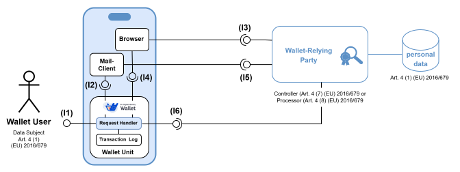

 

# Specification of Common Interface for Data Deletion Requests to Relying Parties

## Abstract

The present document specifies the common protocols and interfaces according to Article 5a (5) (a) (ix) of
[(EU) No 910/2014](http://data.europa.eu/eli/reg/2014/910/2024-10-18) used by a Wallet Unit for invoking a suitable external application,
such as a browser, an email client or a phone application, for requesting the
erasure of personal data pursuant to Article 17 of Regulation [(EU) 2016/679](http://data.europa.eu/eli/reg/2016/679/oj)
at a Wallet-Relying Party for personal data, which was previously provided by a Wallet Unit.

### [GitHub Discussion](https://github.com/eu-digital-identity-wallet/eudi-doc-standards-and-technical-specifications/discussions/378)

## Licensing and Reuse

© European Union, 2025-2026.

This document is made available under the Creative Commons Attribution 4.0 International licence (CC BY 4.0), unless otherwise stated.

You may reuse this document provided that appropriate credit is given and any changes are indicated.

The full licence text is available at https://creativecommons.org/licenses/by/4.0/ .

## Versioning

| Version | Date       | Description                                          |
|---------|------------|------------------------------------------------------|
| `0.1`   | 2025-05-27 | Initial version for first discussions.               |
| `0.2`   | 2025-06-12 | Update after first discussions.                      |
| `0.9`   | 2025-06-22 | Update after second focus meeting.                   |
| `0.10`  | 2025-07-16 | Minor editorial update.                              |
| `0.11`  | 2026-01-30 | Editorial update (licensing and reuse clarification). |
| `1.0` | 2026-07-12 | Final Version.                                   |

## Notational Conventions

The key words "MUST", "MUST NOT", "REQUIRED", "SHALL", "SHALL NOT",
"SHOULD", "SHOULD NOT", "RECOMMENDED", "NOT RECOMMENDED", "MAY", and
"OPTIONAL" in this document are to be interpreted as described in
"Key words for use in RFCs to Indicate Requirement Levels" [RFC2119](https://datatracker.ietf.org/doc/html/rfc2119).
The interpretation should only be applied when the terms appear in
all capital letters.

## 1. Introduction

The present document specifies the **common protocols and interfaces** according to Article 5a (5) (a) (ix) of
[(EU) No 910/2014](http://data.europa.eu/eli/reg/2014/910/2024-10-18) used by a Wallet Unit for invoking a suitable external application,
such as a browser, an email client or a phone application, for **requesting the
erasure of personal data** according to Article 17
[(EU) 2016/679](http://data.europa.eu/eli/reg/2016/679/oj) **at a Wallet-Relying Party** (WRP) for personal data, which was previously
provided using a Wallet Unit.

The general approach with respect to the protocols and interfaces specified in the present document are
based on the result of the related discussions documented in the corresponding [L+M-Discussion-Paper](https://github.com/eu-digital-identity-wallet/eudi-doc-architecture-and-reference-framework/blob/main/docs/discussion-topics/l%2Bm-data-deletion-and-reporting-of-wrp-to-dpa.md).

## 2. Requirements

### 2.1 Legal Requirements

Article 5a (5) of the regulation [(EU) No 910/2014](http://data.europa.eu/eli/reg/2014/910/2024-10-18) requires that

> European Digital Identity Wallets shall, in particular:
>
> (a) support common protocols and interfaces:
>
> [...]
>
> (ix) for requesting a relying party the erasure of personal data pursuant to Article 17 of Regulation (EU) 2016/679;

Article 6 of [(EU) 2024/2982](http://data.europa.eu/eli/reg_impl/2024/2982/oj) (Communication of data erasure requests) stipulates the following:

> 1. Wallet providers shall ensure that wallet units support protocols and interfaces allowing wallet users to request from wallet-relying parties, with whom they have interacted through those wallet units, the erasure of their personal data provided through those wallet units, in accordance with Article 17 of Regulation (EU) 2016/679.
>
> 2. The protocols and interfaces referred to in paragraph 1 shall allow wallet users to select the wallet-relying parties to which data erasure requests are to be submitted.
>
> 3. Wallet units shall display to the wallet user previously submitted data erasure requests made through those wallet units.

Article 3 of [(EU) 2025/848](http://data.europa.eu/eli/reg_impl/2025/848/oj) (National registers) stipulates the following:

> 1. Member States shall establish and maintain at least one national register of wallet-relying parties with information regarding registered wallet-relying parties established in that Member State.
>
> 2. The register shall include at least the information set out in Annex I.
>
> 3. Member States shall designate at least one registrar to manage and operate at least one national register of wallet-relying parties.
>
> 4. Member States shall make the information set out in Annex I on registered wallet-relying parties publicly available online, both in human-readable form and in a form suitable for automated processing.
>
> 5. The information referred to in paragraph 2 shall be available through a single common application programming interface (‘API’) and through a national website. It shall be electronically signed or sealed by or on behalf of the registrar, in accordance with the common requirements for a single API set out in Section 1 of Annex II.
>
> 6. Member States shall ensure that the API referred to in paragraph 5 complies with the common requirements set out in Section 2 of Annex II.
>
> 7. Member States shall ensure that the registers comply with the relevant common registration policies set out in Article 4.

Article 7 of [(EU) 2025/848](http://data.europa.eu/eli/reg_impl/2025/848/oj) (Wallet-Relying Party Access Certificates (WRPAC))

> 1. Member States shall authorise at least one certificate authority to issue wallet-relying party access certificates.
>
> [...]

Article 8 of [(EU) 2025/848](http://data.europa.eu/eli/reg_impl/2025/848/oj) (Wallet-Relying Party Registration Certificates (WRPRC))

> 1. Member States shall authorise at least one certificate authority to issue wallet-relying party registration certificates. Member States shall ensure that providers of wallet-relying party registration certificates issue those certificates in an automated manner and without undue delay after the registration.
>
> [...]

ANNEX I [(EU) 2025/848](http://data.europa.eu/eli/reg_impl/2025/848/oj) specifies, which
information regarding wallet-relying parties is contained in the register according to Article 3 Nr. 2 of [(EU) 2025/848](http://data.europa.eu/eli/reg_impl/2025/848/oj):

> 1.	Where applicable, the name of the wallet-relying party, as stated in an official record together with identification data of that official record.
   >>  (a)	if none are applicable, paragraph 2 shall be used.
> 2.	Where applicable, a user-friendly name of the wallet-relying party that can be either a trade name or service name that is recognisable to the user.
> 3.	Where applicable, one or more identifiers of the wallet-relying party, as stated in an official record together with identification data of that official record, expressed as:
>
>       (a)	an economic operators registration and identification (‘EORI’) number as referred to in Commission Implementing Regulation (EU) No 1352/2013 ; 
>
>       (b)	a registration number as registered in a national business register;
>
>       (c)	a legal entity identifier (‘LEI’) as referred to in Commission Implementing Regulation (EU) 2022/1860 ;
> 
>       (d)	a value-added tax (‘VAT’) registration number;
>
>       (e)	an excise number as referred to in Article 2(12) of Council Regulation (EU) No 389/2012 ;
>
>       (f)	a tax reference number;
>
>       (g)	an european unique identifier (‘EUID’) as referred to in Commission Implementing Regulation (EU) 2021/1042 ;
>  
>       (h)	other national identifier or identifiers.
>   
> 4.	The physical address where the wallet-relying party is established.
>
> 5. Where applicable, a uniform resource locator (‘URL’) belonging to the wallet-relying party.
>
> 6. here the identifier is expressed in accordance with points 3 (a), (d), (f) or (h), the country indicator of the Member State where the wallet-relying party is established shall be prefixed using ISO 3166-1 Alpha 2 codes, with the exception of the country indicator for Greece which shall be ‘EL’.
>
> 7. Contact information of the wallet-relying party, at least one of the following:
> 
>       (a)	a website where the wallet-relying party can be contacted for matters pertaining to provision of helpdesk and support;
>
>       (b)	a phone number where the wallet-relying party can be contacted for matters pertaining to its registration and intended use of the wallet units;
>
>       (c)	an e-mail address where the wallet-relying party can be contacted for matters pertaining to its registration and intended use of the wallet unit.
>
> 8. A description of the type of services the wallet-relying party provides.
> 9.	For each intended use, a list of the data, including attestations and attributes, that the relying party intends to request, a user-friendly name and a technical name, the attestation type and any other syntaxes that the data is grouped under, in a machine-readable format for automated processing.
> 10.	For each intended use, a description of intended use of the data that the wallet-relying party intends to request from wallet units.
> 11.	An indication whether the wallet-relying party is a public sector body.
> 12.	The entitlement or entitlments of the wallet-relying party, that shall be expressed as follows:
>
>       (a)	‘Service_Provider’ to express the entitlement of the wallet-relying party as a provider of services;
>
>       (b)	‘QEAA_Provider’ to express the entitlement of the wallet-relying party as a qualified trust service provider issuing qualified electronic attestations of attributes;
>
>       (c)	‘Non_Q_EAA_Provider’ to express the entitlement of the wallet-relying party as a trust service provider issuing non-qualified electronic attestations of attributes;
>
>       (d)	‘PUB_EAA_Provider’ to express the entitlement of the wallet-relying party as a provider of electronic attestations of attributes issued by or on behalf of a public sector body responsible for an authentic source;
>
>       (e)	‘PID_Provider’ to express the entitlement of the wallet-relying party as a provider of person identification data;
>
>       (f)	‘QCert_for_ESeal_Provider’ to express the entitlement of the wallet-relying party as a qualified trust service provider issuing qualified certificates for electronic seals;
>
>       (g)	‘QCert_for_ESig_Provider’ to express the entitlement of the wallet-relying party as a qualified trust service provider issuing qualified certificates for electronic signatures;
>
>       (h)	‘rQSigCDs_Provider’ to express the entitlement of the wallet-relying party as a qualified trust service provider providing qualified trust services for the management of a remote qualified electronic signature creation device;
>
>       (i)	‘rQSealCDs_Provider’ to express the entitlement of the wallet-relying party as a qualified trust service provider providing qualified trust services for the management of a remote qualified electronic seal creation device;
>
>       (j)	‘ESig_ESeal_Creation_Provider’ to express the entitlement of the wallet-relying party as a non-qualified trust service provider providing a non-qualified trust service for remote creation of electronic signatures or electronic seals;
> 13.	With regard to paragraph 12, point (c), Member States may provide additional sub-entitlements to state which attestations a specific non-qualified issuer of electronic attestation of attributes shall issue.
> 14.	Where applicable, an indication that the wallet-relying party relies upon an intermediary acting on behalf of the relying party who intends to rely upon the wallet.
> 15.	Where applicable, an association to the intermediary that the wallet-relying party is relying upon that is acting on behalf of the relying party who intends to rely upon the wallet. 
> 16. 	Where applicable, an association to the wallet-relying party that is relying upon the intermediary to whom the wallet-relying party access certificate has been issued and   that is acting on behalf of the relying party who intends to rely upon the wallet.

ANNEX IV [(EU) 2025/848](http://data.europa.eu/eli/reg_impl/2025/848/oj) specifies requirements for wallet-relying party access certificates, which in particular includes the following:

> [...] 
> 3. The certificate policy and certificate practice statement applicable to the provision of wallet-relying 
> party access certificates shall be syntactically and semantically harmonised across the Union and shall, 
> as applicable, comply with with standard [ETSI TS 119 411-8 V1.1.1 (2025-10)](https://www.etsi.org/deliver/etsi_ts/119400_119499/11941108/01.01.01_60/ts_11941108v010101p.pdf), and shall include:
> [...]
> 
> (k) the obligation for the wallet-relying party access certificates to include: 
> [...]
> 
> – the information referred to in Annex I,  points 1, 2, 3, 5, 6, 7, (a), (b), (c) and 16;
> 
> –	a reference to the national wallet-relying part register in which the relying party is registered.
> [...]

ANNEX V [(EU) 2025/848](http://data.europa.eu/eli/reg_impl/2025/848/oj) specifies requirements for wallet-relying party registration certificates, which in particular includes the following:

> [...]
> 3. The wallet-relying party registration certificate policy and certificate practice statement applicable 
> to the provisioning of wallet-relying party registration certificates shall be syntactically and semantically 
> harmonised across the Union and shall comply with [ETSI TS 119 475 V1.2.1. (2026-03)](https://www.etsi.org/deliver/etsi_ts/119400_119499/119475/01.02.01_60/ts_119475v010201p.pdf), and shall include: [...]
> 
>  (j)	the obligation for the wallet-relying party registration certificates: [...]
>
> –	to include the information referred to in Annex I, points 1, 2, 3, 5, 6 and  8, 9, 10, 11, 12, 13, 14 and 15;
> [...]

### 2.2 High-Level Requirements

The set of high-level requirements after the discussions documented in the [L+M-Discussion-Paper](https://github.com/eu-digital-identity-wallet/eudi-doc-architecture-and-reference-framework/blob/main/docs/discussion-topics/l%2Bm-data-deletion-and-reporting-of-wrp-to-dpa.md) and
the two focus meeting on the present topic, which slightly changed `DATA_DLT_02` and `DATA_DLT_07`
and added `DATA_DLT_08` and `DATA_DLT_09` are as follows:

| **Index**    | **Requirement specification**  |
|---|------|
| DATA_DLT_01  | A Wallet Provider SHALL ensure that its Wallet Units support the technical specifications mentioned in DATA_DLT_02, allowing a User to request from a Relying Party the erasure of their attributes that were presented by that Wallet Unit to that Relying Party, in accordance with Article 17 of Regulation (EU) 2016/679. |
| DATA_DLT_02  | A Wallet Unit SHALL support at least one of the following possibilities to request data deletion from a Wallet-Relying Party: a)  Open a URL in an external browser, which is assumed to be available on the platform, to ask for the deletion of data in a web form provided by the Wallet-Relying Party. b)  Open an external mail client, if available on the platform, and start a draft email to the Wallet-Relying Party (see also `DATA_DLT_08` below). c) Open a phone application, if available on the platform, in order to call the Wallet-Relying Party.                                             |
| DATA_DLT_03  | A Wallet Instance SHALL provide a function where the User may select one Relying Party for which an attribute deletion request must be submitted.   |
| DATA_DLT_05  | A Wallet Unit SHALL include attribute deletion requests in a log so they can be presented to the User via the dashboard (as specified in [TS10](./ts10-data-portability-and-download-(export).md) and [Topic 19](https://github.com/eu-digital-identity-wallet/eudi-doc-architecture-and-reference-framework/blob/main/docs/annexes/annex-2/annex-2-high-level-requirements.md#a2319-topic-19---user-navigation-requirements-dashboard-logs-for-transparency) respectively). |
| DATA_DLT_06  | The log SHALL also document the initiation of a data deletion request and include as a minimum: - Date and time of attribute deletion request, - Relying Party to which the request was made, - Attributes requested to be removed.    |
| DATA_DLT_07  | Before executing a data deletion request, a Wallet-Relying Party SHALL authenticate the requesting User, or the request itself, using appropriate authentication mechanisms of its own choice. The Wallet-Relying Party SHOULD use the authentication and signature facilities offered by the User's Wallet Unit for this purpose.   |
| DATA_DLT_08  | The text in the `subject` of the mail prepared by the Wallet Unit according to `DATA_DLT_02` (b) SHALL clearly indicate that the purpose of the mail is to asks for the deletion of the personal data according to Article 17 of (EU) 2016/679, which has been previously provided by the user via its Wallet Unit.   |
| DATA_DLT_09  | The text in the `body` of the mail prepared by the Wallet Unit according to `DATA_DLT_02` (b) SHOULD contain the necessary information for the WRP to handle the request in an appropriate manner. This in particular includes the information which personal attributes are requested to be deleted, or that all previously exchanged personal data are requested to be deleted. |

## 3. Specification of Protocols and Interfaces

### 3.1 System Architecture

As agreed upon within the discussions documented in the [L+M-Discussion-Paper](https://github.com/eu-digital-identity-wallet/eudi-doc-architecture-and-reference-framework/blob/main/docs/discussion-topics/l%2Bm-data-deletion-and-reporting-of-wrp-to-dpa.md)
the general approach is to utilise the already existing interfaces and processes of the
Wallet-Relying Parties as much as possible and abstain from the creation of
additional technical interfaces.

The resulting system architecture is depicted in the following figure:

### 3.2 Interfaces

As shown in the figure above, there are the following interfaces:

* **(I1)** - is a user-friendly user interface, which allows to access the functionality of the Wallet Unit,
  browse through the Transaction Log, search for transactions within a given period in time or with a given Wallet-Relying Party
  and in particular allows to request the deletion of the previously provided personal data according to Article 17
  [(EU) 2016/679](http://data.europa.eu/eli/reg/2016/679/oj) at a specific Wallet-Relying Party.

* **(I2)** - is a platform-specific interface, which allows to invoke a browser on the platform to open a specific
  URL of the WRP, which may have been provided in the `supportURI` element within the registration 
  information in [TS5](./ts5-common-formats-and-api-for-rp-registration-information.md) and consequently 
  may be available in the wallet-relying party access certificate, as required by ANNEX IV Nr. 3 (k) 
  of [(EU) 2025/848](https://eur-lex.europa.eu/eli/reg_impl/2025/848/oj). The web application available at this URL is assumed to provide further information how to request the
  deletion of the personal data, which has previously been provided by a Wallet Unit.

* **(I3)** - represents a logical interface provided by the web application hosted by the Wallet-Relying party at the given URL contained in the `supportURI` of the Wallet-Relying party according to [TS5](./ts5-common-formats-and-api-for-rp-registration-information.md). Note, that it is assumed
  that there is always a browser on the platform, but a mail client is considered to be optional. Therefore, it is
  RECOMMENDED in [TS5](./ts5-common-formats-and-api-for-rp-registration-information.md) that WRPs register a `supportURI`, which points to the website for helpdesk
  and support according to ANNEX I Nr. 7 (a) [(EU) 2025/848](http://data.europa.eu/eli/reg_impl/2025/848/oj).

* **(I4)** - is a platform-specific interface, which allows to invoke a mail client on the platform, if available.
  The invocation can be realised using a `mailto:` link with the email address of the WRP, a suitable text for the `subject`
  of the mail and a proposal of a text for the `body` of the mail in which the data subject asks for the deletion of the personal data,
  which has previously been provided by a Wallet Unit.

* **(I5)** - represents a logical interface given by the mail system of the WRP, which is
  assumed to exist, if the registration information with respect to the `supportURI` of the WRP according to [TS5](./ts5-common-formats-and-api-for-rp-registration-information.md)
  contains an email address for support. Note, that the Wallet Unit can recognise the type of the endpoint, which is either
  an email address, the URL of a website or a phone number, by inspecting the content of the `supportURI` element.

* **(I6)** - is a platform-specific interface, which allows to invoke the phone application of the platform.

* **(I7)** - is the phone system of the WRP, which SHALL exist, if there is only a phone number
  registered within the `supportURI` element of [TS5](./ts5-common-formats-and-api-for-rp-registration-information.md), as admissibly by ANNEX I Nr. 7 (b) [(EU) 2025/848](http://data.europa.eu/eli/reg_impl/2025/848/oj).

* **(I8)** - is the interface of a Wallet Unit based on [ETSI TS 119 472-2 (v1.2.1)](https://www.etsi.org/deliver/etsi_ts/119400_119499/11947202/01.02.01_60/ts_11947202v010201p.pdf)
  as profiled in Annex II of [(EU) 2024/2982](http://data.europa.eu/eli/reg_impl/2024/2982/oj), which allows to ask for the identification of the data subject, 
  or the creation of a qualified electronic signature as described in [ETSI TS 119 432 (v1.3.1)](https://www.etsi.org/deliver/etsi_ts/119400_119499/119432/01.03.01_60/ts_119432v010301p.pdf) 
  for example. Whether this interface of the Wallet Unit is invoked or not is determined by the Wallet-Relying Party.

### 3.3 Process

The process for requesting the deletion of personal data according to Article 17 [(EU) 2016/679](http://data.europa.eu/eli/reg/2016/679/oj)  and Article 5a (5) (a) (ix) of [(EU) No 910/2014](http://data.europa.eu/eli/reg/2014/910/2024-10-18) contains the following
simple steps:

* **(1)** - The Wallet Unit determines the possible ways for contacting the WRP to request 
  the deletion of data by inspecting the registered `supportURI` information, which is part of the 
  WRPAC, as specified in ANNEX I Nr. 7 and ANNEX IV Nr. 3 (k) of [(EU) 2025/848](http://data.europa.eu/eli/reg_impl/2025/848/oj).
  According to [ETSI TS 119 475 (v1.2.1)](https://www.etsi.org/deliver/etsi_ts/119400_119499/119475/01.02.01_60/ts_119475v010201p.pdf) (Table 1 and Table 3) 
  the registered `supportURI` is encoded as `uniformResourceIdentifier` within the Subject Alternative Name of the WRPAC as 
  specified in clause 4.2.1.6 of [RFC 5280](https://datatracker.ietf.org/doc/html/rfc5280).

* **(2)** - The Wallet Unit shall display the available `supportURI` options to the User for selection, or 
  use a previously configured preference of the User for this choice.

* **(3)** - The Wallet Unit invokes the external application determined by the User in step (2) above, i.e.
  a browser, a mail client or the phone application on the platform of the user, and adds the
  initiated deletion request to the transaction log as specified in `DATA_DLT_05` and `DATA_DLT_06`,
  such that it may later on be displayed to the User, as required by Article 6 Nr. of [(EU) 2024/2982](http://data.europa.eu/eli/reg_impl/2024/2982/oj).

* **(4)** - The data deletion request, which was initiated in step (2), will finally be handled by the WRP. Note, that this step is out of the scope of the present specification.